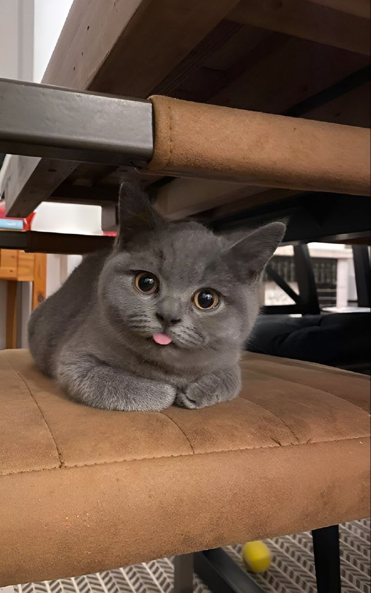

# 🌸 My First Blog Post

Hello, world! This is my first blog post using GitHub Markdown.

## Why I Love Markdown

- It's simple
- No coding needed
- Works beautifully with GitHub Pages

## Here’s a photo of a kitten:

## Here's a photo of a kitten:

Thanks for visiting!
